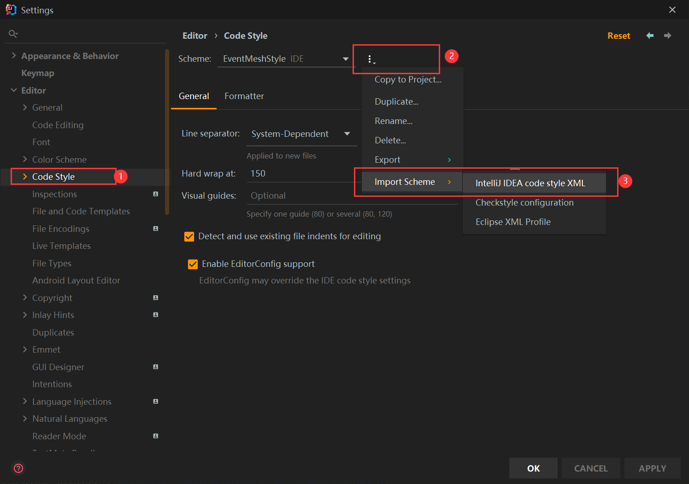

# 如何贡献

如果你是一个新的贡献者，想为eventmesh社区做贡献，请阅读这篇文档，它描述了如何为社区做贡献，如果你在文档中发现任何问题，请随时发表意见或建议。

## 准备

### 开发环境

- 你应该在你的开发环境中安装 JDK。

### 代码风格

#### 导入Code Style

文件位置：源码 `incubator-eventmesh/style`目录下面的 [`eventmesh-code-style.xml`](https://github.com/apache/incubator-eventmesh/blob/master/style/eventmesh-code-style.xml) 文件导入 **`IntelliJ IDEA`**。

```
Editor -> Code Style -> Import Scheme -> IntelliJ IDEA code style XML
```



#### 导入Check Style

文件位置：源码源码 `incubator-eventmesh/style`目录下面的 [`checkStyle.xml`](https://github.com/apache/incubator-eventmesh/blob/master/style/checkStyle.xml)文件导入您的  **`IntelliJ  IDEA`**。

对于 IDEA，您可以通过以下方式导入检查样式文件：

```shell
Editor -> Code Style -> Java -> Scheme -> Import Scheme -> CheckStyle Configuration
```

如果在Import Scheme下看不到CheckStyle Configuration部分，可以先安装CheckStyle-IDEA插件，就可以看到了。

您还可以使用 ./gradlew check 来检查代码风格。
（注意：此命令将检查项目中的所有文件，当您提交 pr 时，ci 将仅检查此 pr 中已更改的文件）。

### 工作流程

以下是贡献者的工作流程：

1. fork 项目到自己的远程仓库

2. clone fork到本地仓库

```git
git clone git@github.com:yourgithub/incubator-eventmesh.git
```

3. 创建一个新分支并处理它
```git
git checkout -b fix_patch_xx
```

4. 保持分支同步
```git
git remote add upstream git@github.com:apache/incubator-eventmesh.git
git fetch upstream master:upstream_master
git rebase upstream_master
```

5. 提交您的更改（确保您的提交信息简洁）

6. 将你的提交推送到你fork的远程仓库

7. 创建pull request

## 解释

[原仓库](https://github.com/apache/incubator-eventmesh )：eventmesh的apache仓库在文中称为原仓库。

[Fork仓库](https://github.com/apache/eventmesh)：从原仓库fork到你自己的个人仓库成为一个fork库。

因此，将原始 EventMesh 存储库 fork 到您自己的存储库中。

## 开发分支

**eventmesh目前的开发分支是Master。请向该分支提交 PR。**

> 我们建议您在您的开发仓库中创建一个新的分支，并将该分支提交pull request到eventmesh 的master 分支。

## 贡献类别

### 错误反馈或错误修复

- 无论是bug反馈还是fix，都需要先创建一个issue，对bug进行详细描述，方便社区通过issue记录方便的查找和查看问题和代码。错误反馈问题通常需要包含对错误信息和可重现场景的完整描述。

### 功能实现，重构

- 如果你打算实现一个新特性（或重构），一定要通过Issue或其他方式与eventmesh核心开发团队进行沟通，并在沟通过程中详细描述新特性（或重构）、机制和场景.

### 文档改进

- 您可以在 [eventmesh-docs](https://github.com/apache/incubator-eventmesh/tree/master/docs) 找到 eventmesh 文档，文档内容的补充和提升对EventMesh也很重要。

## 贡献方式

新贡献者可以通过两种方式为 eventmesh 社区做出贡献：

- 如果您在 eventmesh 代码中发现要修复的错误，或者如果您为 eventmesh 提供了新功能，请在 eventmesh 中提交问题并向 eventmesh 提交 pr。
- eventmesh社区其他贡献者提出了issue，这里社区整理的[`issue for first-time contributors`](https://github.com/apache/incubator-eventmesh/issues/888)比较简单PR，可以帮助你熟悉为eventmesh社区做贡献的过程。

## 提交问题指南

- 如果您不知道如何在 eventmesh 上提出问题，请阅读[关于问题](https://docs.github.com/cn/issues/tracking-your-work-with-issues/quickstart)。

- 在eventmesh社区，有issue模板可以参考，如果类型匹配请使用模板，如果issue模板不符合你的要求，可以开一个空的issue模板，issue请自带匹配特征标签。

- 问题名称，请用一句话简单描述你的问题或目的，并用英文书写，以便于全球交流。

## 拉取请求 (pr) 提交指南

- 如果您不知道如何为 eventmesh 发起 pr，请参阅 [关于 pull request](https://docs.github.com/en/pull-requests/collaborating-with-pull-requests/proposing-changes -to-your-work-with-pull-requests/creating-a-pull-request)。

- 无论是bug修复，还是新特性开发（如果这个pr是新特性开发，那么这个pr中应该包含新特性的文档更新），请向当前开发分支master提交PR。

- 提交pr需要遵循eventmesh提供的模板，同时需要写提交信息，简单描述你提交的pr是干什么的就可以了，详见[模板](https://github.com/apache/incubator-eventmesh/blob/master/.github/PULL_REQUEST_TEMPLATE.md)。

- 您提交的 pr 需要与您正在修复的问题相关联，或者您正在提出的问题，因此您的 PR 标题应以 [ISSUE #xx] 开头。

- 如果您的更改是关于打字错误或小的优化，则无需创建问题，只需提交 PR 和带有 [MINOR] 的标题即可。

**注意：**

- 单个PR提交的修改内容不应过多。如果需要进行大量更改，最好将更改分离到几个单独的 PR。

- 创建 PR 后，一个或多个 committer 将帮助审核 pull request，批准后，此 PR 将合并到 eventmesh 仓库，相关 Issue 将被关闭。

## review

### PR review

All code should be well reviewed by one or more committers. Some principles:

- Readability: Important code should be well-documented. Comply with our [code style](https://github.com/apache/incubator-eventmesh/blob/master/style/checkStyle.xml).

- Elegance: New functions, classes or components should be well-designed.

- Testability: Important code should be well-tested (high unit test coverage).

## 审查

### PR审查

所有代码都应该由一位或多位提交者仔细审查。一些原则：

- 可读性：重要的代码应该有详细的文档记录。遵守我们的[代码风格](https://github.com/apache/incubator-eventmesh/blob/master/style/checkStyle.xml)。

- 优雅：新功能、类或组件应该经过精心设计。

- 可测试性：重要代码应该经过良好测试（单元测试覆盖率高）。

### 许可证审查

EventMesh 遵循 [Apache License 2.0](http://www.apache.org/licenses/LICENSE-2.0.html) 政策。所有源文件应该将 Apache 许可证标头添加到文件标头。 EventMesh 使用 [apache/skywalking-eyes](https://github.com/apache/skywalking-eyes) 检查源文件头。

### PR合并

在一个 PR 被至少一个提交者批准后，它可以被合并。在合并之前，提交者可以更改提交消息，要求提交消息要清晰无重复，并使用 Squash 和 Merge 来确保一个 PR 应该只包含一个提交。
对于大型多人PR，使用Merge进行合并，合并前通过rebase修复提交。

## 社区

### 联系我们

邮箱：dev@eventmesh.apache.org
